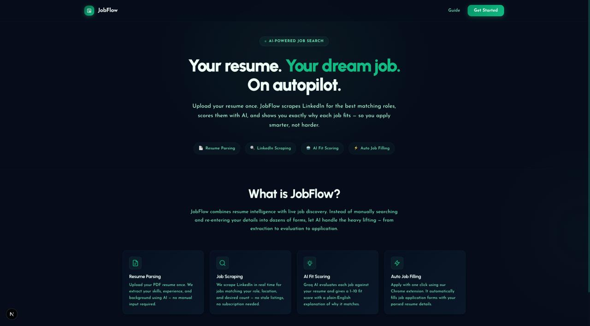
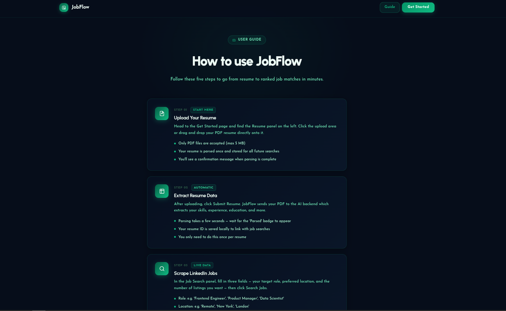
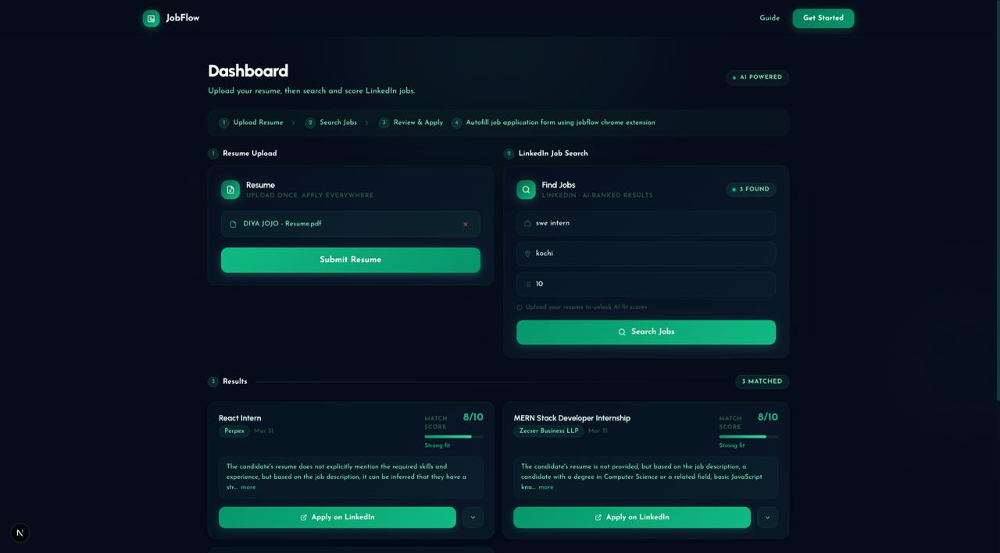

# JobFlow

<div align="center">

[](https://opensource.org/licenses/MIT)
[](http://makeapullrequest.com)
[](https://gssoc.girlscript.tech/)

**An AI-powered job discovery and application platform.**  
Upload your resume once. Get AI-ranked LinkedIn jobs. Apply in one click.

[📖 Architecture](docs/ARCHITECTURE.md) · [🤝 Contributing](CONTRIBUTING.md) · [🐛 Report Bug](https://github.com/mehrinshamim/mini-project/issues/new?template=bug_report.md) · [✨ Request Feature](https://github.com/mehrinshamim/mini-project/issues/new?template=feature_request.md)

</div>

---

## 📸 Screenshots

| Landing Page | Guide | Dashboard |
|:---:|:---:|:---:|
|  |  |  | 
| _Hero, features overview_ | _Step-by step guide_ | _Resume upload + AI-ranked jobs_ |


---

## 📑 Table of Contents

- [✨ Features](#-features)
- [🏗️ Architecture](#️-architecture)
- [🔄 How It Works](#-how-it-works)
- [🚀 Tech Stack](#-tech-stack)
- [🛠️ Project Setup](#️-project-setup)
  - [Prerequisites](#prerequisites)
  - [1. Backend](#1-backend)
  - [2. Frontend](#2-frontend)
  - [3. Chrome Extension](#3-chrome-extension)
- [📂 Project Structure](#-project-structure)
- [🤝 Contributing](#-contributing)
- [🧑‍💻 Development Notes](#-development-notes)
- [📝 License](#-license)

---

## ✨ Features

- **Resume Upload** — Upload your PDF resume to power personalized job matching
- **LinkedIn Job Scraping** — Discover live job listings by role and location via Apify
- **AI Fit Scoring** — Every job scored 1–10 against your resume with plain-English reasoning
- **Application Auto-Filler** — Chrome Extension auto-fills job application forms using your profile
- **Smart Form Detection** — Works on Google Forms, Lever, Greenhouse, and most ATS platforms
- **User-Friendly Dashboard** — Clean, dark-themed interface with animated score cards
- **Step-by-Step Guide** — Built-in guidebook so users can hit the ground running

---

## 🏗️ Architecture


JobFlow has three independently runnable components that work together:

| Component | Technology | Role |
|-----------|-----------|------|
| `frontend/` | Next.js + React + Tailwind | Dashboard, landing page, guide |
| `backend/` | FastAPI + Celery + PostgreSQL | REST API, async AI/scraping tasks |
| `extension/` | Chrome Extension (MV3) | Autofills job application forms |

📖 **[Read the full architecture guide →](docs/ARCHITECTURE.md)**

---

## 🔄 How It Works


1. **Upload** your PDF resume — parsed once by AI (Docling)
2. **Search** by role and location — Apify scrapes live LinkedIn listings
3. **AI scores** each job against your resume (Groq Llama 3.1) — takes 2–3 min
4. **Review** ranked results with fit scores and reasoning
5. **Apply** — Chrome Extension autofills the form for you (Groq Llama 3.3)

---

## 🚀 Tech Stack

| Layer | Technology |
|-------|-----------|
| **Frontend** | Next.js 16, React 19, Tailwind CSS v4, TypeScript |
| **Backend** | FastAPI, Python 3.12+, Celery, SQLModel |
| **Database** | PostgreSQL (via Docker) |
| **Queue** | Redis + Celery (async tasks) |
| **AI Models** | Groq API — Llama 3.1 (scoring), Llama 3.3 (answer gen) |
| **Scraping** | Apify (LinkedIn jobs) |
| **PDF Parsing** | Docling |
| **Extension** | Chrome Manifest V3 |

---

## 🛠️ Project Setup

### Prerequisites

- Python 3.12+ and [`uv`](https://docs.astral.sh/uv/getting-started/installation/)
- Node.js 18+ and `npm`
- Docker + Docker Compose
- Google Chrome

### 1. Backend

```bash
cd backend
cp .env.example .env
```

Open `.env` and set your API keys:
```env
GROQ_API_KEY=your_groq_api_key_here
APIFY_API_TOKEN=your_apify_token_here
```

> 📚 **No Apify account yet?** See [`backend/docs/get-apify-token.md`](backend/docs/get-apify-token.md)  
> 📚 **No Groq account yet?** Get a free key at [console.groq.com](https://console.groq.com)

Start Docker services and apply migrations:
```bash
./setup.sh
```

Start the API server and Celery worker **(two terminals required):**

```bash
# Terminal 1 — API server
cd backend
uv run uvicorn app.main:app --reload

# Terminal 2 — Celery worker
cd backend
uv run celery -A app.worker.celery_app worker --loglevel=info
# macOS: add --pool=solo if you see forking errors
```

> 📖 Full backend details: [`backend/README.md`](backend/README.md)

### 2. Frontend

```bash
cd frontend
npm install
npm run dev
```

Visit **[http://localhost:3000](http://localhost:3000)**

### 3. Chrome Extension

1. Open `chrome://extensions/` in Chrome
2. Enable **Developer mode** (top right toggle)
3. Click **Load unpacked** → select the `extension/` folder

> 📖 Extension contributor guide: [`extension/README.md`](extension/README.md)

---

## 📂 Project Structure

```
JobFlow/
├── docs/                   # Architecture diagrams, data flow, images
│   ├── ARCHITECTURE.md     # Full system architecture reference
│   └── images/             # Diagrams and screenshots
├── frontend/               # Next.js web app (dashboard, guide, landing)
│   └── app/
│       ├── components/     # Navbar, JobCard, ResumeSection, JobSearch
│       ├── dashboard/      # Main user workflow page
│       └── guide/          # Usage tutorial page
├── backend/                # FastAPI API + Celery workers + AI logic
│   ├── app/
│   │   ├── api/            # HTTP route handlers
│   │   ├── services/       # Business logic (parsing, scoring, discovery)
│   │   └── worker/         # Async Celery tasks
│   └── docs/               # API reference, engineering journal, guides
└── extension/              # Chrome Extension for application autofilling
    ├── content.js          # Form field scraper and filler
    ├── background.js       # API relay service worker
    └── popup.html/js       # Extension UI
```

---

## 🤝 Contributing

Contributions are welcome — from first-timers to experienced engineers!

```
1. Browse open issues → pick one labeled "good first issue" or "gssoc"
2. Comment to claim it
3. Fork → branch → code → PR
```

**📋 [Full Contributing Guide →](CONTRIBUTING.md)**  
**🔍 [Browse Open Issues →](https://github.com/mehrinshamim/mini-project/issues)**  
**📐 [Architecture Reference →](docs/ARCHITECTURE.md)**

### For GSSoC Contributors

1. Find an issue labeled `gssoc` or `good first issue`
2. **Comment on the issue before starting** — don't open a PR on an unclaimed issue
3. One issue at a time per contributor
4. PRs should link to their issue: `Closes #42`

---

## 🧑‍💻 Development Notes

- **API Explorer:** When the backend is running, visit `http://localhost:8000/docs` for interactive Swagger UI
- **Engineering Journal:** [`backend/docs/log.md`](backend/docs/log.md) documents every major decision — highly recommended reading for contributors
- **Bruno Collection:** [`backend/bruno/`](backend/bruno/) contains a ready-to-use API collection for testing endpoints

---

## 📝 License

This project is [MIT](LICENSE) licensed.
