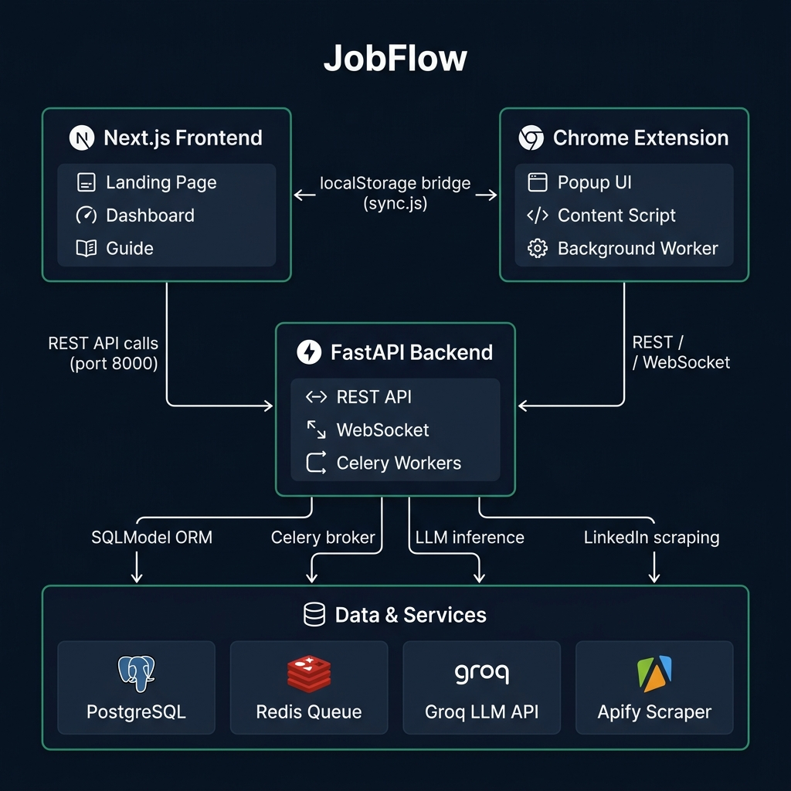
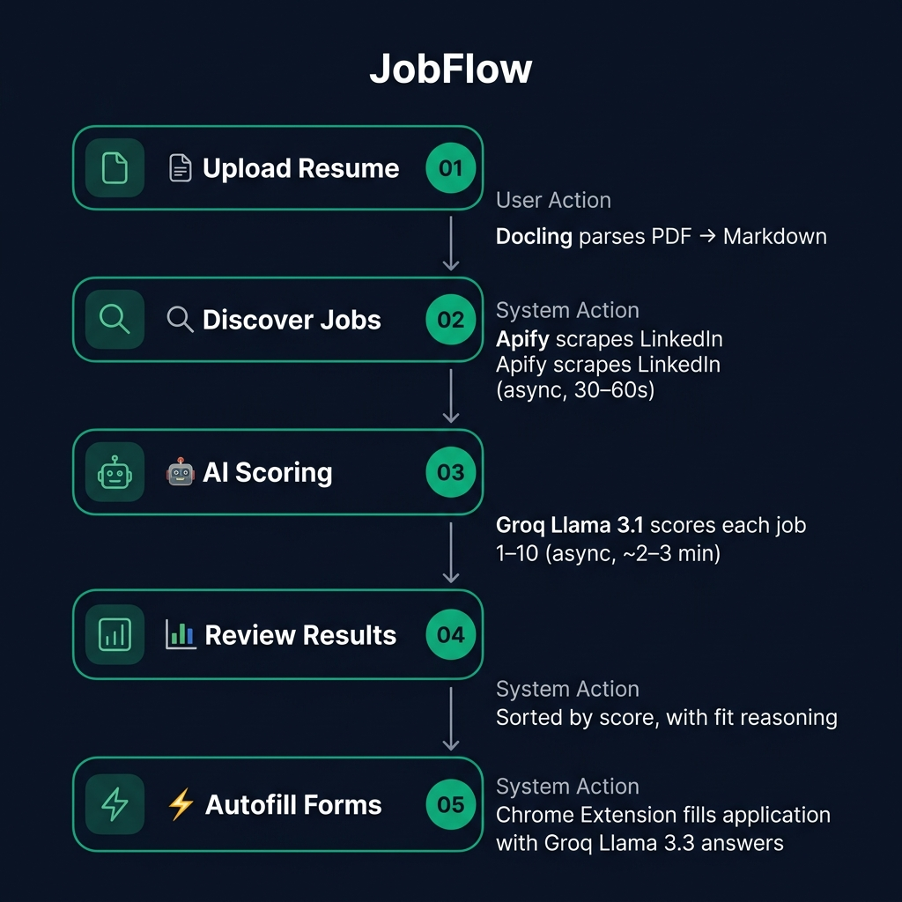

# JobFlow — Architecture Reference

This document explains how the three components of JobFlow (Frontend, Backend, Chrome Extension) are structured, how they connect to each other, and how data flows through the system.

---

## System Overview



JobFlow is a **mono-repo** with three independently runnable components:

| Component | Technology | Port | Purpose |
|-----------|-----------|------|---------|
| `frontend/` | Next.js 16 + React 19 + Tailwind v4 | `3000` | User dashboard, landing page, guide |
| `backend/` | FastAPI + Celery + PostgreSQL + Redis | `8000` | REST API, async task workers, AI services |
| `extension/` | Chrome Extension (Manifest V3) | — | Autofills job application forms |

---

## Component Architecture

### Frontend (`frontend/`)

```
frontend/app/
├── page.tsx                  # Landing page — hero, feature overview
├── layout.tsx                # Root layout — fonts, metadata
├── globals.css               # Design tokens (CSS vars) + animations
├── types.ts                  # Shared TypeScript types (Job)
├── dashboard/page.tsx        # Main user workflow (upload + search + results)
├── guide/page.tsx            # 5-step usage tutorial (static)
└── components/
    ├── Navbar.tsx             # Sticky glass navbar with active-link styling
    ├── ResumeSection.tsx      # PDF drag-drop upload + parse status
    ├── JobSearchWithResults.tsx  # Search form + async polling + job list
    └── JobCard.tsx            # Individual job card with score, reasoning, apply link
```

**State management:** All state lives in component-local `useState`. No global store.  
**API communication:** Direct `fetch()` calls in component files (currently hardcoded to `http://localhost:8000` — see `NEXT_PUBLIC_API_URL` task in the issue tracker).  
**Data persistence:** `resume_id` and `job_id` stored in `localStorage` to bridge to the extension.

---

### Backend (`backend/`)

```
backend/app/
├── main.py                   # FastAPI app, CORS, router registration, lifespan
├── api/
│   ├── resumes.py            # POST /resumes/upload, GET /resumes/{id}
│   ├── jobs.py               # POST /jobs/discover, /score/batch, GET /jobs/
│   └── extension.py          # POST /extension/answers (autofill answers)
├── core/
│   ├── config.py             # Pydantic Settings — reads .env
│   └── database.py           # SQLModel engine + session factory
├── models/
│   └── models.py             # DB tables: Resume, Job, JobSearch, JobSearchResult
├── services/
│   ├── parsing.py            # DoclingService — PDF → Markdown
│   ├── discovery.py          # ApifyService — LinkedIn scraping
│   ├── reasoning.py          # ReasoningService — Groq scoring + answer gen
│   └── extension.py          # ExtensionService — per-question answer generation
└── worker/
    ├── celery_app.py          # Celery app instance (Redis broker + backend)
    └── tasks.py               # Async task implementations
```

**Architecture pattern:** Thin HTTP routers → Stateless service classes → Celery workers for async operations.  
**DB access:** SQLModel (SQLAlchemy under the hood). Sessions injected via FastAPI `Depends()`.  
**Task queue:** Redis as Celery broker AND result backend. Task IDs returned to client for polling.

---

### Chrome Extension (`extension/`)

```
extension/
├── manifest.json             # MV3 manifest — permissions, scripts, popup
├── background.js             # Service worker — relays API calls to backend
├── content.js                # Injected into all pages — scrapes + fills forms
├── popup.html + popup.js     # Extension UI triggered from toolbar icon
├── sync.js                   # Injected on localhost:3000 — syncs localStorage → chrome.storage
└── styles.css                # Styles injected with content.js
```

**Message flow:**
```
popup.js
  → chrome.tabs.sendMessage(TRIGGER_AUTOFILL)
    → content.js: scrapeQuestions()
      → chrome.runtime.sendMessage(GENERATE_ANSWERS)
        → background.js: POST /extension/answers
          → FastAPI → Groq
        ← {answers: [...]}
      ← fill each form field
```

**Data bridge:**  
`sync.js` runs as a content script on `localhost:3000` only. It reads `resume_id` and `job_id` from the frontend's `localStorage` and writes them to `chrome.storage.local`, making them accessible to `background.js`.

---

## Data Flow (End to End)



### Step 1 — Resume Upload
```
User drops PDF → ResumeSection.tsx
  → POST /resumes/upload?user_id=1 (multipart/form-data)
  → parse_resume_task queued in Celery
  → DoclingService: PDF bytes → Markdown text
  → Resume.markdown_content saved in PostgreSQL
  → resume_id returned → stored in localStorage
  → sync.js: localStorage.resume_id → chrome.storage.local
```

### Step 2 — Job Discovery
```
User fills role + location + limit → JobSearchWithResults.tsx
  → POST /jobs/discover {user_id, title, location, limit}
  → JobSearch record created in PostgreSQL
  → discover_jobs_task queued in Celery
  → ApifyService: LinkedIn scraper actor run
  → Jobs saved in PostgreSQL (deduped by URL)
  → JobSearchResult links created (many-to-many)
  → Frontend polls GET /jobs/discover/{task_id}/status every 2s until SUCCESS
```

### Step 3 — AI Scoring
```
(Auto-triggered after discovery succeeds)
  → POST /jobs/score/batch {user_id, resume_id, search_id}
  → score_jobs_task queued in Celery
  → For each job:
      payload = resume_markdown[:6000] + job_description[:4000]
      Groq llama-3.1-8b-instant → {score: 1-10, fit_reasoning: string}
      Job.score + Job.fit_reasoning updated in PostgreSQL
  → Frontend polls GET /jobs/score/{task_id}/status every 2.5s until SUCCESS
```

### Step 4 — Results Display
```
GET /jobs/?user_id=1&search_id=N
  → Jobs returned (currently unsorted — open issue for contributors)
  → JobCard renders: title, company, score bar, reasoning excerpt, Apply link
  → Clicking "Apply on LinkedIn": job_id saved to localStorage
  → sync.js: localStorage.job_id → chrome.storage.local
```

### Step 5 — Form Autofill
```
User navigates to job application form (any website)
  → Opens Chrome Extension popup
  → Clicks "Auto-fill Application Form"
  → popup.js → chrome.tabs.sendMessage({type: "TRIGGER_AUTOFILL"})
  → content.js: scrapeQuestions()
      6-strategy label detection:
        1. aria-label attribute
        2. aria-labelledby (resolved IDs)
        3. input.labels HTMLCollection
        4. label[for="id"] DOM query
        5. Ancestor DOM traversal (8 levels — handles Google Forms)
        6. placeholder fallback
  → background.js: POST /extension/answers {resume_id, job_id, questions[]}
  → ExtensionService: Groq llama-3.3-70b → {answers: [{question, answer}]}
  → content.js: fillField() for each form element
```

---

## Database Schema

```
Resume
├── id (PK)
├── user_id (int, currently always 1)
├── filename (string)
├── markdown_content (text)
└── created_at

Job
├── id (PK)
├── title, company, description
├── url (unique — used for dedup)
├── score (int, nullable — null until scored)
├── fit_reasoning (text, nullable)
├── status (string: "discovered" | "scored")
└── created_at

JobSearch
├── id (PK)
├── user_id
├── search_title, search_location
└── created_at

JobSearchResult          ← many-to-many join
├── job_search_id (FK → JobSearch)
└── job_id (FK → Job)
```

---

## Key Design Decisions

### Why Celery + Redis for async?
LinkedIn scraping takes 30–60 seconds. AI scoring for 20 jobs takes 2–4 minutes. These cannot block an HTTP request. Celery tasks are queued immediately, the task ID is returned, and the client polls for completion.

### Why the localStorage → chrome.storage bridge?
Chrome extensions cannot access a webpage's `localStorage` directly due to security isolation. `sync.js` is a content script injected only on `localhost:3000`. It reads localStorage and writes to `chrome.storage.local`, which `background.js` can then access.

### Why inline styles in the frontend?
The frontend was built quickly and uses inline `style={{}}` extensively for a consistent design. A refactor to Tailwind utility classes (or CSS modules) is an open contributor task — see `globals.css` for the existing CSS custom property tokens.

### Why `user_id=1` everywhere? (Local-first, single-user)
JobFlow is designed as a **local-first, single-user** personal productivity tool. A single default user (`user_id=1`, `email=local@autofiller.dev`) is seeded at startup, and both the frontend and extension hardcode `user_id=1` in all API calls. There is no authentication layer, no login flow, and no multi-user support. This is **by design** — because the backend runs on `localhost`, there is no remote attack surface and no other user whose data could be accessed. IDOR (Insecure Direct Object Reference) concerns do not apply in this architecture. Adding JWT authentication is tracked as a future enhancement for if/when the project evolves into a hosted, multi-tenant service.

---

## Environment Variables

### Backend (`backend/.env`)

| Variable | Required | Default | Description |
|----------|----------|---------|-------------|
| `GROQ_API_KEY` | ✅ Yes | — | Groq API key (get at console.groq.com) |
| `APIFY_API_TOKEN` | ✅ Yes | — | Apify token (get at apify.com) |
| `APIFY_ACTOR_ID` | ✅ Yes | `2s5FNF...` | LinkedIn scraper actor ID |
| `DATABASE_URL` | No | `postgresql://...` | Postgres connection string |
| `REDIS_URL` | No | `redis://localhost:6379/0` | Redis connection string |
| `PARSING_MODEL` | No | `llama-3.1-8b-instant` | Groq model for scoring |
| `ANSWER_MODEL` | No | `llama-3.3-70b-versatile` | Groq model for answer generation |

### Frontend (`frontend/.env.local`)

| Variable | Required | Default | Description |
|----------|----------|---------|-------------|
| `NEXT_PUBLIC_API_URL` | No* | `http://localhost:8000` | Backend API base URL |

> *Not yet implemented — open contributor issue. Currently hardcoded.

---

## Ports Reference

| Service | Port | How to Access |
|---------|------|--------------|
| Next.js Frontend | 3000 | `http://localhost:3000` |
| FastAPI Backend | 8000 | `http://localhost:8000` |
| FastAPI Docs (Swagger) | 8000 | `http://localhost:8000/docs` |
| PostgreSQL | 5432 | Via Docker / DB client |
| Redis | 6379 | Via Docker / Redis CLI |
